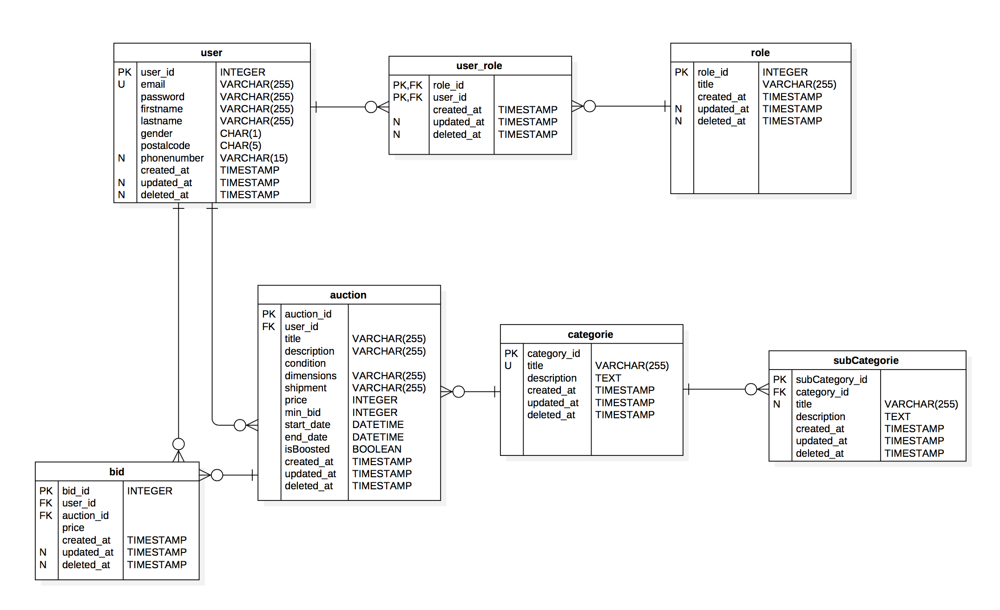
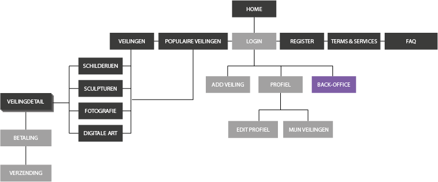
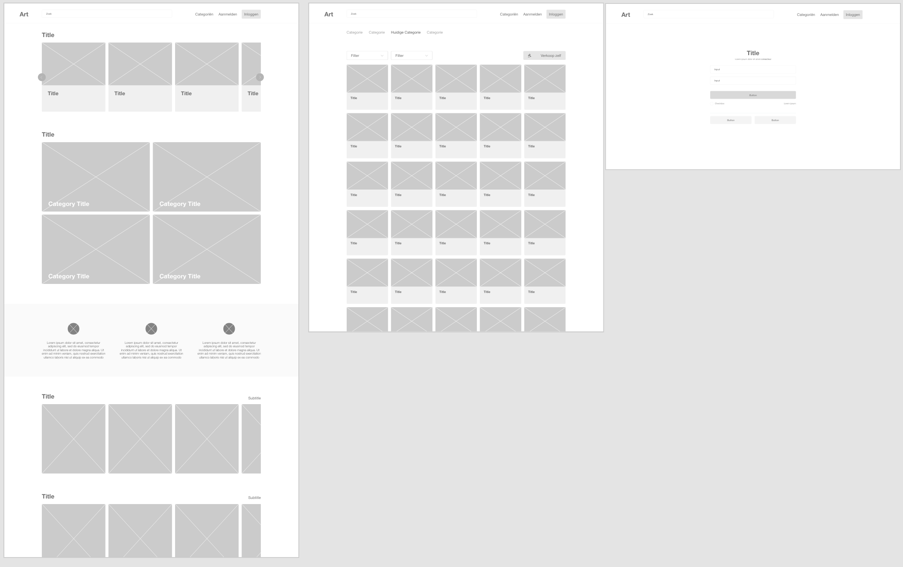
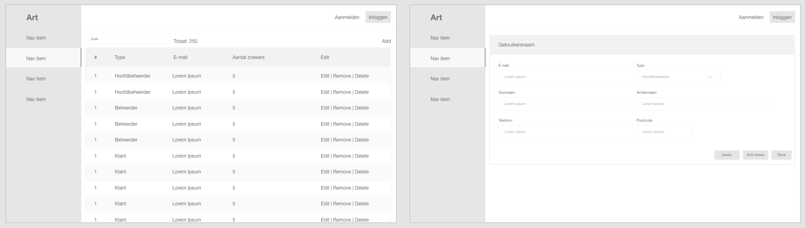
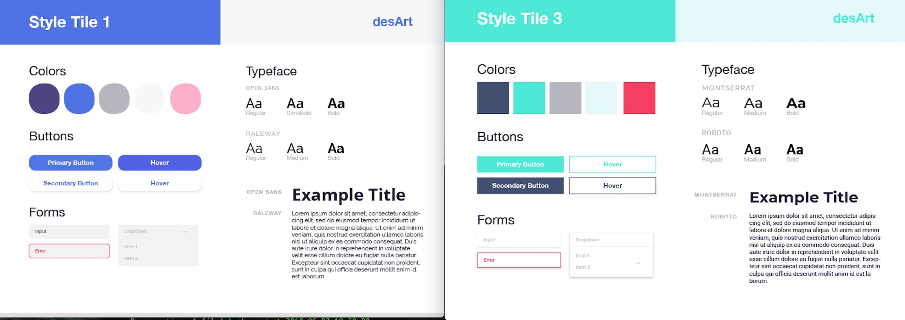
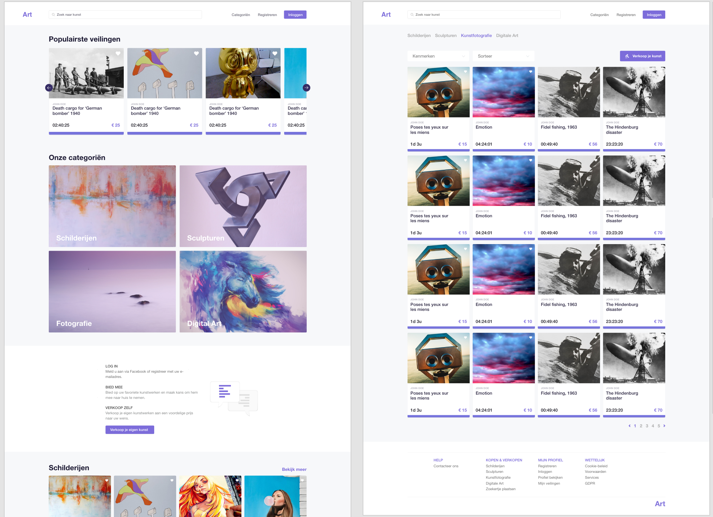
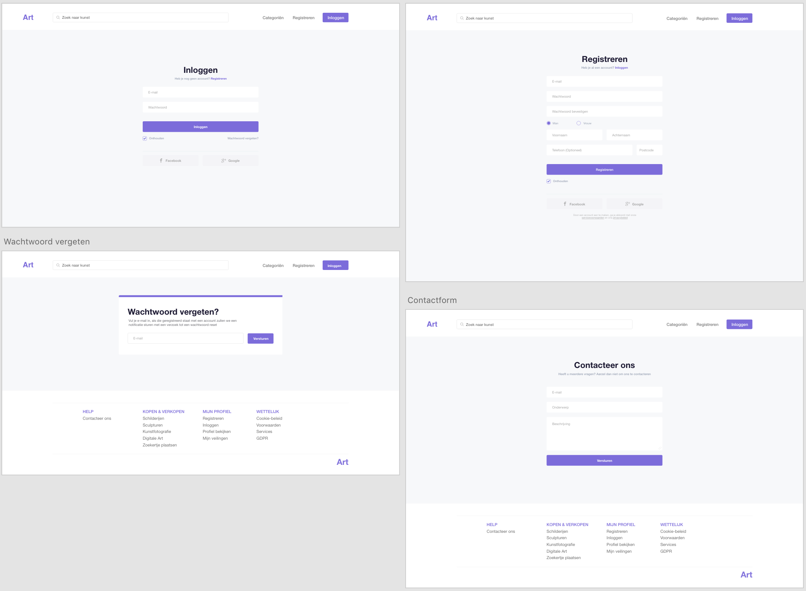
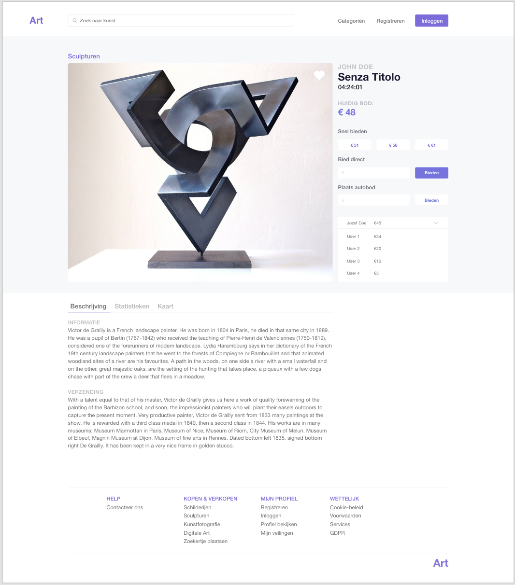
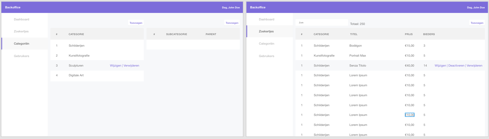
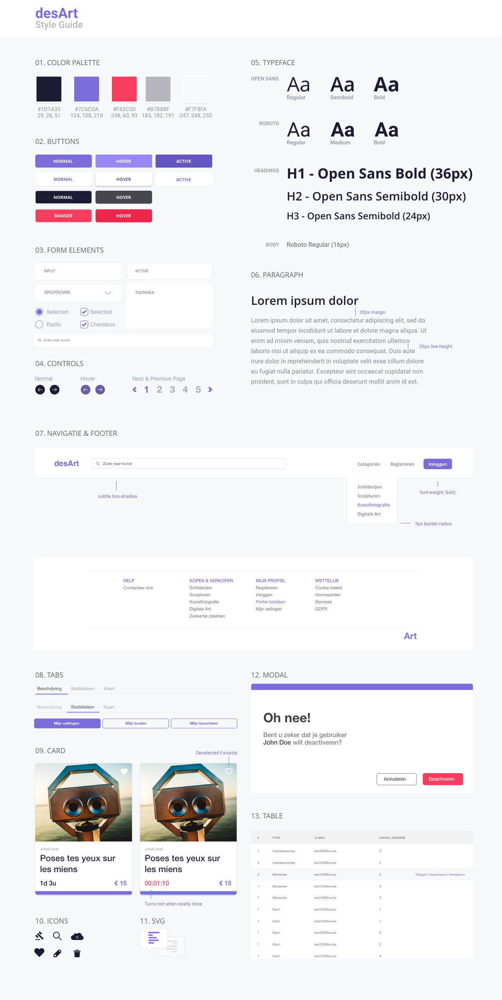

<section data-markdown>
    <textarea data-template>
        ## III. Design
    </textarea>
</section>

<section data-markdown>
    <textarea data-template>
        ### Datamodel
        
    </textarea>
</section>

<section data-markdown>
    <textarea data-template>
        ### Sitemap
        
    </textarea>
</section>

<section data-markdown>
    <textarea data-template>
        ### Wireframes
        
    </textarea>
</section>

<section data-markdown>
    <textarea data-template>
        ### Wireframes
        
    </textarea>
</section>

<section data-markdown>
    <textarea data-template>
        ### Style Tiles
        
    </textarea>
</section>

<section data-markdown>
    <textarea data-template>
        ### Gekozen Style Tile
        
    </textarea>
</section>

<section data-markdown>
    <textarea data-template>
        
    </textarea>
</section>

<section data-markdown>
    <textarea data-template>
        
    </textarea>
</section>

<section data-markdown>
    <textarea data-template>
        
    </textarea>
</section>

<section data-markdown>
    <textarea data-template>
        
    </textarea>
</section>

<section data-markdown>
    <textarea data-template>
        
    </textarea>
</section>